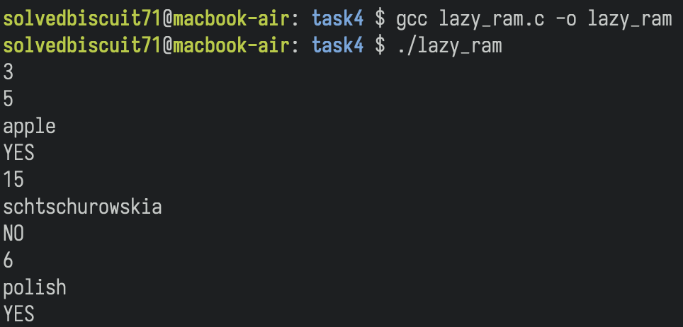

# Task 4

To compile and run the program, use the following command

```bash
gcc lazy_ram.c -o lazy_ram
./lazy_ram
```

# Output

Sample Input

```
3
5
apple
15
schtschurowskia
6
polish
```

Output


